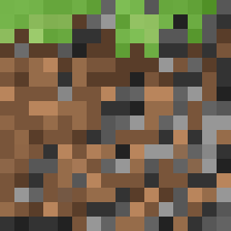

<p align="center">
  
</p>

# Outcrop


## API for Minecraft Bedrock websockets.


## Example - listening and handling custom events
```python3
import asyncio, websockets
from core import OutcropEvent, OutcropAPI # importing outcrop

def chat(data):
    print(data)


playerMessagesEvent = OutcropEvent() # create Outcrop event object
playerMessagesEvent.body.eventName = "PlayerMessage" # listen for player messages

playerMessagesListener = OutcropAPI(chat) # set handler to receive responses
playerMessagesListener.subscribe(playerMessagesEvent) # send websocket

async def main():
    async with websockets.serve(playerMessagesListener.handle, "", 3001):
        await asyncio.Future()

asyncio.run(main())
```


# Installation
```cmd
git clone https://github.com/TensegrityBlockxels/Outcrop.git
```

- Windows 
```cmd
install.bat
``` 
- Linux 
```bash
install.sh
```


## Dependencies
- websockets == 10.3
